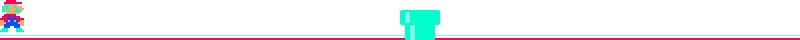

  

  

<h3 align="center">👾 <code>WHOAMI</code></h3>

  I am a final-year <b>Computer Science &amp; AI</b> student at <i>Universiti Teknikal Malaysia Melaka (UTeM)</i>.   
  My architecture is built around <b>Machine Learning</b>, <b>Data Science</b>, and crafting elegant software solutions. 
  I thrive at the intersection of deep learning algorithms and scalable cloud infrastructure.

  

<h3 align="center">💻 <code>TECH_STACK.exe</code></h3>

   <b>🧬 LANGUAGES</b>  
  

    
    
    
    
    
    
    
    
    
  

  <b>🧠 AI &amp; FRAMEWORKS</b>  
  

    
    
    
    
    
    
    
    
    
    
  

  <b>☁️ CLOUD &amp; DATABASE</b>  
  

    
    
    
    
    
    
    
    
    
    
  

  <b>⚙️ HARDWARE, TOOLS &amp; DESIGN</b>  
  

    
    
    
    
  

  

<h3 align="center">📊 <code>SYSTEM_METRICS</code></h3>

  
  
    

  
  
  
    

  

    

  

  

<h3 align="center">📡 <code>DECRYPTED_QUOTE</code></h3>

  
     
  
     
  

